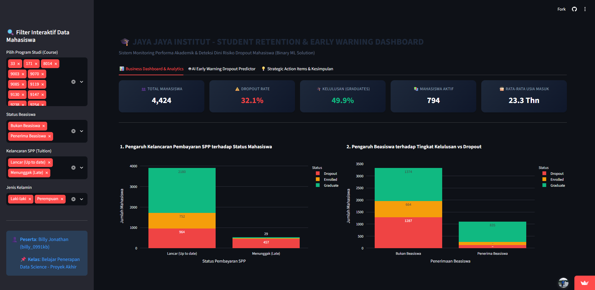

# Proyek Akhir: Menyelesaikan Permasalahan Institusi Pendidikan - Jaya Jaya Institut

- **Nama**: Billy Jonathan
- **Email**: billyjonathan048@gmail.com
- **ID Dicoding**: billy_0991kb
- **Institusi**: Universitas Kuningan / Jaya Jaya Institut

---

## Business Understanding

Jaya Jaya Institut merupakan salah satu institusi pendidikan perguruan tinggi terkemuka yang telah berdiri sejak tahun 2000. Sepanjang sejarahnya, institusi ini telah melahirkan ribuan lulusan dengan reputasi akademik yang sangat baik di berbagai bidang industri. Namun, seiring berkembangnya jumlah mahasiswa, perguruan tinggi ini menghadapi kendala serius dalam mempertahankan kelangsungan studi mahasiswanya. Berdasarkan data historis, tingkat **dropout** mahasiswa mencapai **32,12%** (1.421 dari 4.424 mahasiswa).

Tingginya angka kegagalan studi (*dropout*) ini menimbulkan kerugian multidimensional:
1. **Penurunan Akreditasi & Daya Tarik Kampus**: Retensi dan kelulusan tepat waktu merupakan metrik utama dalam standar penilaian mutu akreditasi nasional dan internasional.
2. **Kerugian Finansial Institusi**: Kehilangan pendapatan berkelanjutan dari uang kuliah tunggal / SPP semesteran dari mahasiswa yang mengundurkan diri.
3. **Dampak Sosial & Karier Mahasiswa**: Mahasiswa yang dropout berisiko mengalami kendala sosial, beban utang pendidikan, dan kesulitan memasuki pasar tenaga kerja formal.

### Permasalahan Bisnis
1. Faktor-faktor apa saja (performa akademik tahun pertama, kondisi finansial/SPP, serta latar belakang demografis) yang menjadi pemicu utama tingginya angka *Dropout* di Jaya Jaya Institut?
2. Program studi (*Course*) dan karakteristik mahasiswa mana yang memiliki kerentanan dropout paling tinggi?
3. Bagaimana membangun sistem monitoring visual interaktif (Business Dashboard) dan model Machine Learning prediktif yang mampu mendeteksi sedini mungkin mahasiswa yang berisiko dropout (*Dropout* vs *Graduate*) agar pihak akademik/dosen wali dapat memberikan bimbingan dan intervensi khusus (*Early Warning & Academic Tutoring System*)?

### Cakupan Proyek
- **Data Understanding & Data Preparation**:
  - Mengeksplorasi dataset 4.424 baris data mahasiswa.
  - Memisahkan data mahasiswa aktif berstatus **Enrolled** (794 siswa) untuk simulasi inferensi deteksi dini di masa mendatang.
  - Menggunakan data berlabel historis **Dropout (1)** dan **Graduate (0)** (3.630 siswa) untuk melatih model klasifikasi biner.
- **Interactive Business Dashboard & Prototype Web App**: Membangun aplikasi web interaktif berbasis **Streamlit** dan **Plotly** yang memuat visualisasi metrik akademik, filter dinamis, dan simulator deteksi dini dropout bertenaga AI.
- **Machine Learning Modeling**: Mengembangkan dan mengevaluasi model klasifikasi biner (Logistic Regression, Random Forest Classifier, Gradient Boosting) dengan akurasi mencapai **92,7%** dan ROC-AUC **0.977**.
- **Standalone Inference Tool (`prediction.py`)**: Skrip CLI mandiri untuk memproses prediksi data mahasiswa aktif secara *batch* atau per individu.
- **Rekomendasi Strategis (Action Items)**: Menyusun solusi nyata dan terukur bagi manajemen rektorat Jaya Jaya Institut.

---

## Persiapan Lingkungan (Setup Environment)

Petunjuk instalasi dan konfigurasi environment untuk menjalankan proyek:

### Setup Environment - Anaconda
```bash
conda create --name main-ds python=3.9
conda activate main-ds
pip install -r requirements.txt
```

### Setup Environment - Shell/Terminal
```bash
pip install pipenv
pipenv install
pipenv shell
pip install -r requirements.txt
```

Isi berkas `requirements.txt`:
```
numpy>=1.24.0
pandas>=2.0.0
scipy>=1.10.0
matplotlib>=3.7.0
seaborn>=0.12.0
scikit-learn>=1.2.0
joblib>=1.3.0
streamlit>=1.30.0
plotly>=5.18.0
```

---

## Business Dashboard & Machine Learning Prototype

Proyek ini menyediakan aplikasi web interaktif all-in-one berbasis **Streamlit** (`app.py`) yang menggabungkan **Business Dashboard Monitoring** dan **AI Early Warning Dropout Predictor Prototype**.

### 🌐 Tautan Akses Cloud (Streamlit Community Cloud & GitHub):
- **Tautan Live Prototype & Business Dashboard**:  
  👉 **https://jaya-jaya-institut-dxnuwsa5u7dbsbzbqnfngc.streamlit.app/**
- **Tautan Repository GitHub**:  
  👉 **https://github.com/BillyJonathan29/jaya-jaya-institut**

---

### 🚀 Cara Menjalankan Prototype & Dashboard secara Lokal:
Jalankan perintah berikut pada terminal di direktori proyek:
```bash
streamlit run app.py
```
*(Aplikasi dashboard akan otomatis terbuka pada browser Anda di alamat: `http://localhost:8501`)*

---

### 📸 Tampilan Screenshot Business Dashboard:
Screenshot visualisasi dashboard dilampirkan pada berkas: `billy_0991kb-dashboard.png` (dan `username_dicoding-dashboard.png`).



---

### Fitur & Komponen Utama Dashboard:
1. **Interactive Sidebar Filters**:
   - Filter berdasarkan **Program Studi / Course** (seluruh kode program studi).
   - Filter status **Penerima Beasiswa (*Scholarship*)**.
   - Filter status **Kelancaran SPP (*Tuition fees up to date*)**.
   - Filter **Jenis Kelamin**.
2. **Institutional Overview Cards (KPI)**:
   - Total Mahasiswa Dianalisis: **4.424 orang**.
   - Mahasiswa Dropout: **1.421 orang (32,1%)** — *Status: High Dropout Rate*.
   - Mahasiswa Lulus (*Graduate*): **2.209 orang (49,9%)**.
   - Mahasiswa Aktif (*Enrolled*): **794 orang (18,0%)**.
   - Rata-rata Usia Masuk Kuliah: **23,3 Tahun**.
3. **Visualisasi Interaktif Faktor Risiko**:
   - **Kelancaran SPP vs Dropout**: Mahasiswa yang menunggak SPP memiliki tingkat dropout di atas **85%**.
   - **Beasiswa vs Kelulusan**: Mahasiswa penerima beasiswa memiliki tingkat kelulusan tinggi (**>75%**) dibanding non-beasiswa.
   - **Program Studi**: Memetakan program studi dengan tingkat kelulusan terbaik vs program studi yang rawan dropout.
   - **Performa Akademik Semester 1 & 2**: Mahasiswa yang gagal pada lebih dari 50% SKS di tahun pertama terkonsentrasi kuat pada kategori *Dropout*.
   - **Top 10 ML Feature Importance**: Faktor penentu terbesar status mahasiswa.
4. **Tab Prototype AI Early Warning Dropout Predictor**:
   - Sistem inferensi biner untuk menginput parameter profil mahasiswa dan langsung memperoleh probabilitas prediksi (*Dropout / Graduate*), indikator *Gauge Chart Risk Score*, level risiko (*Tinggi / Sedang / Rendah*), serta rekomendasi tindakan bimbingan akademik.

---

## Machine Learning Modeling & Prediction Tool

Sesuai metodologi Data Science yang tepat, data berstatus **Enrolled (794 mahasiswa aktif)** dipisahkan dari training, dan model dilatih menggunakan data berlabel historis **Dropout (1)** dan **Graduate (0)** (3.630 data).

Model machine learning terbaik dilatih menggunakan algoritma **Gradient Boosting** dan **Random Forest Classifier**. Model mencapai performa:
- **Akurasi**: **92,70%**
- **Weighted Precision**: **90,53%**
- **Weighted Recall**: **90,85%**
- **F1-Score**: **0.9069**
- **ROC-AUC Score**: **0.9772**

Seluruh artefak model telah tersimpan pada folder `model/`:
- `model/random_forest_student_model.joblib`: Model Machine Learning Random Forest terlatih.
- `model/scaler.joblib`: Preprocessor standarisasi fitur numerik.
- `model/target_encoder.json`: Mapping encoding kelas target (1 = Dropout, 0 = Graduate).
- `model/feature_names.json`: Metadata nama fitur input model.

### Cara Menjalankan Skrip Prediksi CLI (`prediction.py`):

#### 1. Menjalankan Demo Prediksi pada Data Mahasiswa Aktif (Enrolled):
```bash
python prediction.py --sample
```

#### 2. Memprediksi Data Mahasiswa dari Berkas CSV Baru:
```bash
python prediction.py --file path/to/data_mahasiswa_baru.csv --output hasil_prediksi.csv
```

#### Output Prediksi:
- `Predicted_Status`: Status prediksi (*Dropout / Graduate*).
- `Dropout_Probability (%)`: Persentase risiko dropout (0 - 100%).
- `Dropout_Risk_Level`: Tingkat risiko (*TINGGI / High Dropout Risk*, *SEDANG / Moderate Risk*, *RENDAH / Safe*).

---

## Conclusion

Berdasarkan seluruh tahapan analisis data dan pemodelan machine learning:
1. **Tingkat Dropout Jaya Jaya Institut Sangat Kritis (32,12%)**: Sebanyak sepertiga dari total populasi mahasiswa gagal menyelesaikan studinya.
2. **Akar Masalah Utama (Root Causes)**:
   - **Performa Akademik Tahun Pertama**: Jumlah mata kuliah lulus pada Semester 1 dan 2 (`Curricular_units_1st_sem_approved` & `2nd_sem_approved`) merupakan prediktor paling dominan dalam kelangsungan studi.
   - **Kendala Finansial & Tunggakan SPP**: Ketidakmampuan membayar SPP tepat waktu memicu pengunduran diri secara drastis (>85% dropout).
   - **Dukungan Beasiswa**: Keberadaan beasiswa terbukti secara empiris meningkatkan angka retensi dan kelulusan mahasiswa.
   - **Faktor Usia Pendaftaran**: Mahasiswa dengan usia masuk yang lebih tua (>25 tahun) memiliki risiko dropout lebih tinggi karena benturan komitmen kerja dan keluarga.

---

## Rekomendasi Action Items (Strategic Business Recommendations)

Untuk menekan laju *dropout rate* dan meningkatkan persentase kelulusan tepat waktu di Jaya Jaya Institut:

### 1. Penerapan Sistem Peringatan Dini Akademik (*Academic Early Warning System*)
- Pasang sistem otomatisasi di portal akademik yang mendeteksi mahasiswa dengan kelulusan SKS < 50% pada akhir Semester 1.
- Wajibkan dosen wali dan program studi untuk memberikan kelas responsi tambahan, bimbingan tutor sebaya, dan konseling akademik intensif sebelum mahasiswa memasuki semester 2.

### 2. Skema Restrukturisasi Pembayaran SPP & Dana Bantuan Darurat
- Sediakan opsi pembayaran SPP bertahap (cicilan bulanan) bagi mahasiswa yang mengalami kesulitan keuangan agar tidak langsung terkena penangguhan akademik.
- Alokasikan pos dana bantuan beasiswa darurat untuk mahasiswa berprestasi yang terancam putus kuliah karena kendala ekonomi.

### 3. Program Pendampingan Khusus Mahasiswa Usia Matang & Perantau
- Sediakan fleksibilitas jadwal kuliah (kelas hybrid / rekaman materi) untuk mahasiswa yang bekerja atau berusia matang (*non-traditional students*).
- Adakan program orientasi adaptasi dan komunitas mahasiswa perantau (*displaced students*) guna mendukung kesehatan mental dan adaptasi sosial di kampus.

### 4. Integrasi Machine Learning Predictor pada Sistem Informasi Akademik
- Manfaatkan modul prediksi `app.py` dan `prediction.py` setiap awal semester untuk memetakan mahasiswa dengan status *High Dropout Risk* secara proaktif sehingga tindakan mitigasi dapat dilakukan sebelum terlambat.
